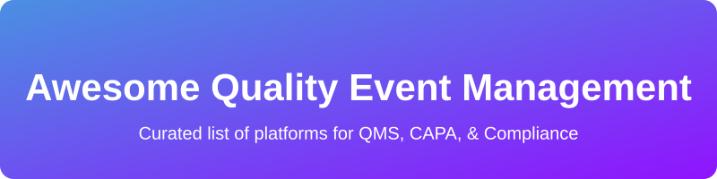

# Awesome-Quality-Event-Management

<!-- Keywords: QMS, CAPA, Quality Management System, Open Source QMS, Compliance, ISO 13485, Part 11 -->

 
 

**Quality Management System ⚙️ (QMS)** / Quality Event Management platforms handle document control, CAPA (Corrective and Preventive Action), nonconformances, deviations, audits, training, risk management, change control, and regulatory compliance (ISO 13485, 21 CFR Part 11, GxP, etc.). Leading commercial tools include MasterControl, Sparta TrackWise, ETQ Reliance, Qualio, Greenlight Guru, ComplianceQuest, QT9, AssurX, Ideagen QMS, and Honeywell Forge QMS.

Below is a **curated list** of notable platforms and their open-source 🐧 equivalents. Fully validated enterprise eQMS solutions are rare in pure open source, so the emphasis is on practical open-source 🐧 tools for CAPA, document control, audits, GRC, and quality workflows that organizations can self-host and extend.

## 🏢 SaaS / Hosted Platforms

| Product | Description | Pricing | Free Tier Limit | Company Size |
|---------|-------------|---------|-----------------|--------------|
| **[Honeywell Forge QMS](https://www.honeywell.com/)** | Industrial quality management solution integrated with Honeywell’s broader operations and manufacturing platforms. | Custom / Contact Sales | None | ~$36B Revenue |
| **[ETQ Reliance](https://www.etq.com/)** (also referred to as Octave Reliance) | Highly configurable no-code quality management platform with extensive workflow automation and EHS extensions. | Custom / Contact Sales | None | ~$5B Revenue (Hexagon) |
| **[MasterControl](https://www.mastercontrol.com/)** | Comprehensive cloud QMS for life sciences with strong document control, training, CAPA, and audit management. Widely used in regulated manufacturing. | Custom / Contact Sales | None | >$1B Valuation |
| **[Ideagen QMS](https://www.ideagen.com/)** | Quality and compliance suite used across regulated industries for document control, audits, and risk. | Custom / Contact Sales | None | >$1B Valuation |
| **[Sparta TrackWise / TrackWise Digital](https://www.spartasystems.com/)** | Enterprise quality and compliance platform focused on CAPA, deviations, complaints, and audit trails (now under larger portfolios). | Custom / Contact Sales | None | $1.3B Acquired |
| **[Greenlight Guru](https://www.greenlight.guru/)** | Purpose-built eQMS for medical device companies with design controls, risk management, and audit readiness features. | Custom / Contact Sales | None | >$100M ARR |
| **[ComplianceQuest](https://www.compliancequest.com/)** | Salesforce-native quality and compliance platform covering CAPA, audits, document control, and supplier quality. | Custom / Contact Sales | None | ~$100M+ Valuation |
| **[Qualio](https://www.qualio.com/)** | Modern cloud QMS popular with life sciences and SaMD teams, emphasizing document control, training, and AI-assisted compliance. | Custom / Contact Sales | None | ~$100M+ Valuation |
| **[AssurX](https://www.assurx.com/)** | Enterprise quality management and compliance software with strong CAPA, complaint handling, and audit capabilities. | Custom / Contact Sales | None | ~$50M Valuation |
| **[QT9 QMS](https://qt9software.com/)** | Modular web-based QMS supporting ISO and FDA compliance with electronic signatures and workflow automation. | Custom / Contact Sales | None | <$20M Valuation |

## 🔓 Open-Source Software

### Dedicated / Emerging QMS & CAPA Platforms
- **[QAtrial](https://github.com/MeyerThorsten/QAtrial)** [!\[GitHub stars\](https://img.shields.io/github/stars/MeyerThorsten/QAtrial)** — Enterprise-ready open-source 🐧 quality management platform (AGPL-3.0?style=social&color=white)](https://github.com/MeyerThorsten/QAtrial)** — Enterprise-ready open-source 🐧 quality management platform (AGPL-3.0/stargazers) — Enterprise-ready open-source 🐧 quality management platform (AGPL-3.0) with requirements tracing, test management, risk evaluation, CAPA tracking, electronic signatures, audit trails, SSO, and validation documentation. Docker-ready.
- **[Open QMS (IridiumSoftware)](https://github.com/IridiumSoftware/open-qms)** [!\[GitHub stars\](https://img.shields.io/github/stars/IridiumSoftware/open-qms)** — GitHub-native open-source 🐧 QMS generator that produces traceable quality system scaffolds for regulated industries (medical devices, pharma, aerospace, etc.?style=social&color=white)](https://github.com/IridiumSoftware/open-qms)** — GitHub-native open-source 🐧 QMS generator that produces traceable quality system scaffolds for regulated industries (medical devices, pharma, aerospace, etc./stargazers) — GitHub-native open-source 🐧 QMS generator that produces traceable quality system scaffolds for regulated industries (medical devices, pharma, aerospace, etc.) with clause-to-template traceability and CAPA/issue workflows.
- **[pHKapa](https://github.com/pHAlkaline/phkapa)** [!\[GitHub stars\](https://img.shields.io/github/stars/pHAlkaline/phkapa)** — Open-source nonconformity and CAPA management software. Supports register → review → plan (root cause + action) → verification workflows and cost-of-quality tracking (MIT?style=social&color=white)](https://github.com/pHAlkaline/phkapa)** — Open-source nonconformity and CAPA management software. Supports register → review → plan (root cause + action) → verification workflows and cost-of-quality tracking (MIT/stargazers) — Open-source nonconformity and CAPA management software. Supports register → review → plan (root cause + action) → verification workflows and cost-of-quality tracking (MIT).
- **[OpenQMS.net / C-realize](https://www.c-realize.com/qms)** — Lightweight, cloud-native open-source 🐧 QMS designed with biopharmaceutical (GxP, Part 11, Annex 11) standards in mind.

### GRC, Audit & Compliance Platforms
- **[Probo](https://github.com/getprobo/probo)** [!\[GitHub stars\](https://img.shields.io/github/stars/getprobo/probo)** — Open-source GRC platform (MIT?style=social&color=white)](https://github.com/getprobo/probo)** — Open-source GRC platform (MIT/stargazers) — Open-source GRC platform (MIT) for SOC 2, GDPR, ISO 27001 and similar frameworks. Covers risk, controls, vendor risk, access reviews, audit programs, and document approval workflows. Self-hostable with MCP/GraphQL APIs.
- **[OpenWorkpaper](https://github.com/Bobby10105/OpenWorkpaper)** [!\[GitHub stars\](https://img.shields.io/github/stars/Bobby10105/OpenWorkpaper?style=social&color=white)](https://github.com/Bobby10105/OpenWorkpaper/stargazers) — Open-source audit management platform focused on the modern audit lifecycle, task tracking, RBAC, and professional exports. Fully self-hostable.
- **[Autonomous EHS](https://github.com/SafetyMP/Autonomous-EHS-Management)** [!\[GitHub stars\](https://img.shields.io/github/stars/SafetyMP/Autonomous-EHS-Management)** — Open-source (Apache 2.0?style=social&color=white)](https://github.com/SafetyMP/Autonomous-EHS-Management)** — Open-source (Apache 2.0/stargazers) — Open-source (Apache 2.0) EHS/IMS console covering incidents, CAPA, audits, evidence, and analytics. Self-hostable with optional AI assistance.
- **[eramba](https://www.eramba.org/)** — Popular open-source 🐧 IT GRC / Governance, Risk & Compliance application used for controls, risk, audits, and compliance tracking.

### Workflow, Document Control & Supporting Tools
- **[Doorstop](https://github.com/doorstop-dev/doorstop)** [!\[GitHub stars\](https://img.shields.io/github/stars/doorstop-dev/doorstop?style=social&color=white)](https://github.com/doorstop-dev/doorstop/stargazers) — Open-source requirements management tool often used as a lightweight foundation for traceability in regulated projects.
- **[ProcessMaker](https://www.processmaker.com/)** (Community / open-source 🐧 editions) — Powerful open-source 🐧 BPM platform frequently used to build CAPA, deviation, and quality approval workflows.
- **[QDMS](https://mdcplus.fi/blog/top-free-qms-systems-manufacturing-quality/)** — Open-source Quality Document Management System focused on document control, audits, and ISO 9001-style compliance workflows.
- **[Senaite / Bika LIMS](https://github.com/senaite)** — Open-source LIMS with strong quality control, nonconformance, and laboratory quality management features (GPL).
- **[Odoo Quality](https://www.odoo.com/)** (Community Edition) — Quality control points, alerts, and inspection worksheets as part of the broader open-source 🐧 Odoo ERP suite.

### Notable Mentions
- Various organizations successfully run lightweight QMS processes on top of **GitHub / GitLab** (issues + PRs + CODEOWNERS for change control and CAPA) or self-hosted document platforms such as **Nextcloud**, **Alfresco**, or **Mayan EDMS**.
- AI-assisted QMS prototypes (e.g., AI-QMS projects on GitHub) are emerging for document control and audit support, though most still require validation for regulated use.

---

**How to contribute**  
Fork this repository, add a new project (with link + short description + category), and open a pull request.  
Prefer actively maintained open-source 🐧 projects that support CAPA, document control, audits, or broader quality/compliance workflows.

**License**  
This list is public domain / CC0. Feel free to copy into your own awesome list or README.

Star the projects you find useful — open-source 🐧 quality and compliance tooling continues to mature for regulated industries! ✅
